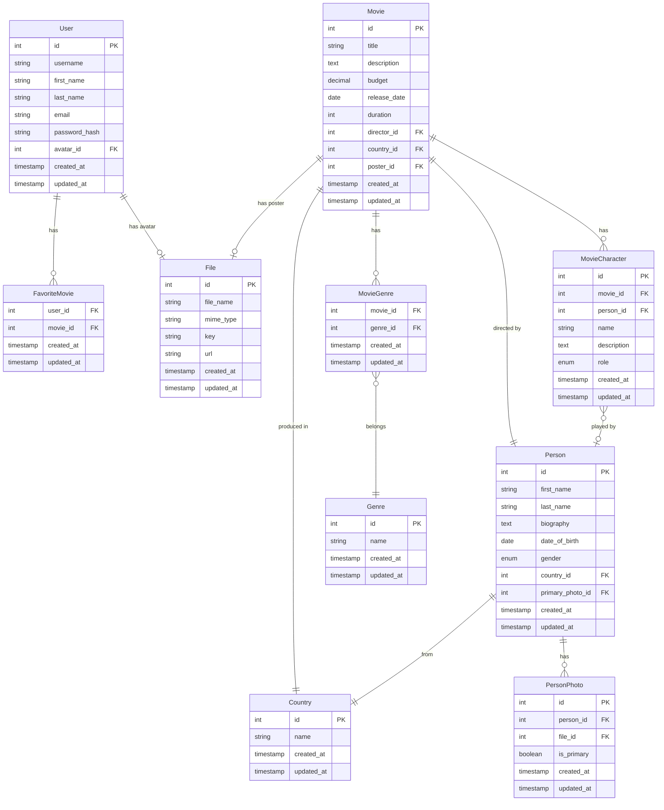

## ER Diagram

```mermaid
erDiagram
    User ||--o{ FavoriteMovie : has
    User ||--o| File : "has avatar"
    Movie ||--o| File : "has poster"
    Movie ||--|| Country : "produced in"
    Movie ||--|| Person : "directed by"
    Movie ||--o{ MovieGenre : has
    MovieGenre }o--|| Genre : belongs
    Movie ||--o{ MovieCharacter : has
    MovieCharacter }o--o| Person : "played by"
    Person ||--o{ PersonPhoto : has
    Person ||--|| Country : "from"
    
    User {
        int id PK
        string username
        string first_name
        string last_name
        string email
        string password_hash
        int avatar_id FK
        timestamp created_at
        timestamp updated_at
    }
    
    File {
        int id PK
        string file_name
        string mime_type
        string key
        string url
        timestamp created_at
        timestamp updated_at
    }
    
    Movie {
        int id PK
        string title
        text description
        decimal budget
        date release_date
        int duration
        int director_id FK
        int country_id FK
        int poster_id FK
        timestamp created_at
        timestamp updated_at
    }
    
    Person {
        int id PK
        string first_name
        string last_name
        text biography
        date date_of_birth
        enum gender
        int country_id FK
        int primary_photo_id FK
        timestamp created_at
        timestamp updated_at
    }
    
    Country {
        int id PK
        string name
        timestamp created_at
        timestamp updated_at
    }
    
    Genre {
        int id PK
        string name
        timestamp created_at
        timestamp updated_at
    }
    
    MovieGenre {
        int movie_id FK
        int genre_id FK
        timestamp created_at
        timestamp updated_at
    }
    
    MovieCharacter {
        int id PK
        int movie_id FK
        int person_id FK
        string name
        text description
        enum role
        timestamp created_at
        timestamp updated_at
    }
    
    PersonPhoto {
        int id PK
        int person_id FK
        int file_id FK
        boolean is_primary
        timestamp created_at
        timestamp updated_at
    }
    
    FavoriteMovie {
        int user_id FK
        int movie_id FK
        timestamp created_at
        timestamp updated_at
    }
```
